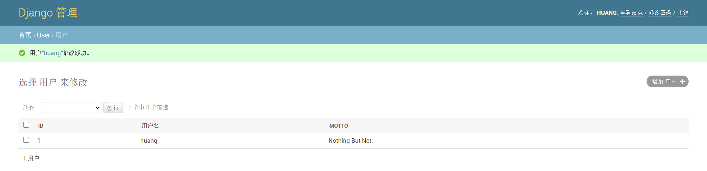
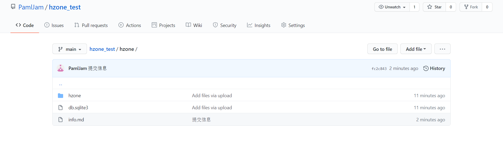
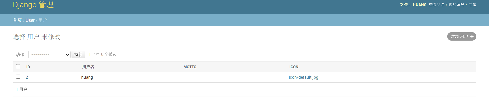
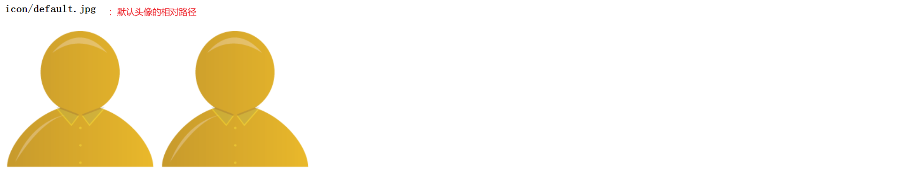
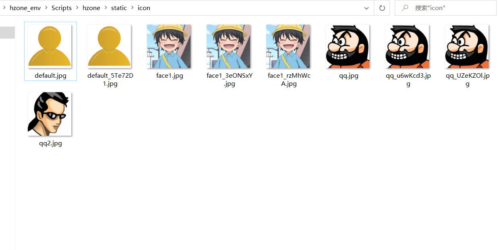
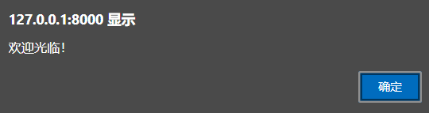
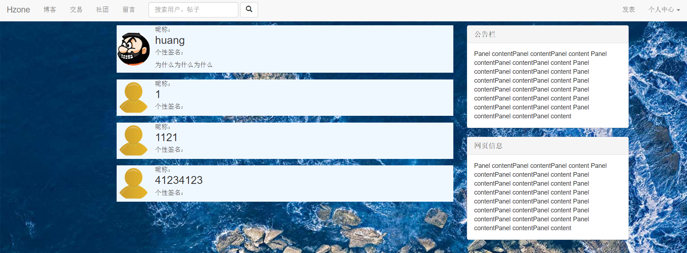

### 项目准备

创建虚拟环境

```powershell
C:\Users\Huang\Desktop>virtualenv hzone_env
```

进入虚拟环境

```powershell
C:\Users\Huang\Desktop\hzone_env\Scripts>activate
```

安装Django

```powershell
(hzone_env) C:\Users\Huang\Desktop\hzone_env\Scripts>pip install Django==2.1.5 -i https://pypi.tuna.tsinghua.edu.cn/simple
```

创建项目

```powershell
(hzone_env) C:\Users\Huang\Desktop\hzone_env\Scripts>django-admin startproject hzone
```

### 拓展模型

https://cloud.tencent.com/developer/article/1099744

已有属性

- username
- password
- email
- first_name
- last_name

1. 新建用户 app

```powershell
(hzone_env) PS C:\Users\Huang\Desktop\hzone_env\Scripts\hzone> python manage.py startapp user
```

2. 自定义模型

```python
from django.db import models
from django.contrib.auth.models import AbstractUser

class User(AbstractUser):	
# 与内置User相同，自定义User也需要继承自抽象基类AbstractUser
    motto = models.TextField(max_length=24)
    # 用户个性签名
    class Meta(AbstractUser.Meta):
        pass
```

3. 注册应用
4. 系统认证

```python
# settings.py
AUTH_USER_MODEL = 'user.User'
# appname + modelname

# 修改语言与时区
LANGUAGE_CODE = 'zh-hans'
TIME_ZONE = 'Asia/Shanghai'
```

5. 后台显示

```python
from django.contrib import admin
from .models import User

@admin.register(User)
class UserAdmin(admin.ModelAdmin):
    list_display = (
        'id',
        'username',
        'motto',
    )
```

6. 更新数据库

7. 创建超级管理员

```powershell
(hzone_env) PS C:\Users\Huang\Desktop\hzone_env\Scripts\hzone> python manage.py createsuperuser
用户名: huang
电子邮件地址:
Password:hjx123456
Password (again):hjx123456
```



### 模板 & 首页

1. 新建文件夹 templates
2. templates 路径

```python
# setting.py
'DIRS': [os.path.join(BASE_DIR,'templates'),]
```

3. 新建 templates\base.html
    新建 templates\home.html

4. 设置背景

https://blog.csdn.net/weixin_33770878/article/details/92888720

```html
<body background="图片来源：必应壁纸.jpg" style="background-attachment:fixed";>
<!-- 固定在屏幕 -->
</body>
```

### 项目托管

1. 新建代码仓库 Github repository
2. 上传项目核心文件夹 hzone
    Add file : Upload files : Drag files here ... : Commit changes


3. 本地新建备份文件夹 backup

4. Git Bash Here
5. 将存储库克隆到当前目录中

```bash
git clone https://github.com/PamlJam/hzone_test.git
```

6. 新增文件 backup\hzone_test\hzone\info.md
7. 提交修改

```bash
cd hzone_test/
git add .
git commit -m"提交信息"
git push 或者强修改 git push -f origin main
```

8. 查看修改



### 显示图片

https://blog.csdn.net/water_Popcorn/article/details/100535020

1. 添加静态文件
    hzone_env\Scripts\hzone\static\icon\default.jpg

2. 配置路径

```python
# setting.py

STATIC_URL = '/static/'

STATICFILES_DIRS=(
    os.path.join(BASE_DIR,'static'),
)
```

3. 模板访问

```html

<!-- 加载静态文件 -->

```


### 默认头像

1. 安装图像处理标准库

```powershell
(hzone_env) PS C:\Users\Huang\Desktop\hzone_env\Scripts> pip install pillow -i https://pypi.tuna.tsinghua.edu.cn/simple
```

2. 新增User属性

```python
icon = models.ImageField(default="./static/icon/default.jpg",upload_to='./static/icon/')
# parm1 默认头像路径
# parm2 上传相对路径
```

3. 后台显示 & 更新数据库



4. 模板访问

```html
<h3>
    {{ user.icon }}
</h3>

<!-- 绝对路径 -->

<!-- 也是绝对路径 -->
```



### 上传头像

#### 数据库操作

随机生成文件名，避免文件覆盖



1. 生成表单

```html
<form enctype="multipart/form-data" action="/user/upload_icon/" method="post">
<!-- enctype 数据编码 -->
    <div style="background-color: aliceblue;">
        
        
        <input type="file" name="icon">
        <button>更改</button>
    </div>
</form>
```

2. 视图函数

```python
def upload_icon(request):
    if request.method == 'POST':
    # 判断请求
        icon = request.FILES.get('icon', None)
        # 读取表单文件信息
        if icon:
            request.user.icon = icon
            # 更改
            request.user.save()
            # 保存
            return HttpResponse('seccess')
        else:
        # 空提交
            return HttpResponse('error')
```

#### 二进制读写

需指定文件名，所有文件格式普遍适用

https://www.cnblogs.com/huchong/p/7910131.html


### 异步响应

1. 引用

```html
<script src="https://cdn.jsdelivr.net/npm/jquery@1.12.4/dist/jquery.min.js"></script>
<!-- jQuery -->
```

2. jQuery Ajax

```js

    <script type="text/javascript">
        // id 选择器 : #
        $('#login_form').submit(function(){
       	// 拦截提交 submit
            $.ajax({
                url:'/user/log_in/',
                // 请求地址，与表单一致
                type:'POST',
                // 请求方式，与表单一致
                data:$('#login_form').serialize(),
                // 前台数据序列化
                cache:false,
                // 缓存关闭
                success:function(context){
                // 请求成功回调函数
                    if(context['status'] == 'SUCCESS'){
                        alert("欢迎光临！");
                        // 弹窗警示
                        window.location.href = '/';
                        // 页面跳转
                    }
                    if(context['status'] == 'ERROR'){
                        alert("账号或密码错误");
                    }
                },
            });
            return false;
        	// 中断默认动作
        });
    </script>
	
```

3. 视图函数

```python
from django.http import JsonResponse
from django.contrib.auth import authenticate

def log_in(request):
    if request.user.is_authenticated:
    # 登录判断
        raise Http404('None')
    elif request.method == 'POST':
        un = request.POST.get('un','')
        pw = request.POST.get('pw','')
        user = authenticate(request, username=un, password=pw)
		# 认证用户
        context = {}
        if user is not None:
            context['status'] = 'SUCCESS'
            # 写入状态
            login(request, user)
            # 用户登录
        else:
            context['status'] = 'ERROR'
        return JsonResponse(context)
    	# 将字典转为JSON格式
    else:
        return render(request,'login.html',{})
```



### 留言板

1. 创建应用

```powershell
>python manage.py startapp board
```

2. 显示新消息

https://blog.csdn.net/qq_32444825/article/details/80608345

```javascript
if (context['status'] == 'SUCCESS'){
    var msg = '<h3>' + context['author'] + "已发布" +context['time'] + '</h3>';
    // 允许h5语法
    $('#stk').prepend(msg);
    // 追加内容
    window.location.reload();
    // 页面刷新
    $("#stk").load(location.href + " #stk"); // 注意空格
    // 局部刷新
    $('#text_box').val('');
    // 清空输入
}
```

### 底部加载

https://blog.csdn.net/saindy5828/article/details/7756315

```html
<!DOCTYPE html>
<html>
<body>
    <head>
        <!-- 引用jQuery -->
    </head>
    
    <div id="stk" style="height:960px"> Hello World </div>
    
    <script>
        $(document).ready(function(){
        // 页面加载结束后为 dom 添加事件
            $(window).scroll(function(){
                // 监听鼠标滚动
                var past = $(window).scrollTop(); 
                // 超出高度	单位为像素
                var now = $(window).height();
                // 屏幕高度 固定值为 722 px
                var total = $(document).height();
                // 文档高度 初始值为 div.height : 960px
                if (total - 50 <= past + now){
                // 加载条件
                    $("#stk").append('<div style="height:500px"> <hr> <div>');
                    // 追加元素
                }
            });
        });
    </script>
</body>
</html>
```

### 分页显示

1. 设 置 Message 排序规则
2. 视图函数

```python
from django.core.paginator import Paginator

def msg_stk(request):
    context = {}
    if request.method == 'GET':
        msgs = Message.objects.all()
        paginator = Paginator(msgs,4)
        # 分页设置
        n = request.GET.get("page",1)
        # 获取页码 默认为一
        if int(n) > paginator.num_pages:
        # 超出范围
            raise Http404('None')
        p = paginator.get_page(n)
        # 页面内容
        context['msgs'] = p
        return render(request,'stk.html',context)
```

### 加载分页

https://blog.csdn.net/krzover/article/details/72674730

```html

    <div id="stk">
        <div id="cur">
        <!-- 初始加载 page = 1 -->
        
            <div class="row" style="background-color: aliceblue;">
                <div class="col-md-2">
                    <br>
                    <a href="/user/{{ each.author.id }}" class="center-block">
                        <!--  点击头像，进入空间  -->
                        
                    </a>
                    <h4><b>{{ each.author.username }}</b></h4>
                </div>
                <div class="col-md-8">
                    <h5>{{ each.time }}</h5>
                    <hr>
                    <p>{{ each.content }}</p>
                </div>
                <div class="col-md-2"></div>
            </div>
            <br>
        
            <h2 style="color: aliceblue;">
                暂无留言
            </h2>
        
        </div>
    </div>




    <script>
        var url = window.location.href + '?page=';
        // 网址
        var num = 1;
        // 页码
        $(document).ready(function(){
            $(window).scroll(function(){
                var past = $(window).scrollTop(); 
                var now = $(window).height();
                var total = $(document).height();
                if (total <= past + now && num){
                    num += 1;
					// 翻页
                    var new_div = document.createElement("div"); 
                    // 新建容器
                    new_div.setAttribute('id','p'+num);
                    // 唯一编号
                    $("#stk").append(new_div);
                    // 追加
                    $("#p"+num).load(url + num + ' #cur');
                    // 加载内容
                }
            });
        });
    </script>

```

### 站内搜索

1. 表单

```html
<form class="navbar-form navbar-left" action="/search/">
<!-- 默认采用 GET 请求 -->
    <div class="form-group">
        <input name="wd" type="text" class="form-control" placeholder="搜索用户、帖子">
        <!-- http://127.0.0.1:8000/search/?wd=123 -->
        <!-- 传递参数 -->
    </div>
    <button type="submit" class="btn btn-default">
        <span class="glyphicon glyphicon-search" aria-hidden="true"></span>
        <!-- 替换样式 -->
    </button>
</form>
```

2. 简单逻辑

```python
from django.shortcuts import redirect

def search(request):
    context = {}
    wd = request.GET.get('wd')
    if wd == '':
    # 搜索内容为空
        referer = request.META.get("HTTP_REFERER",'/')
        # 先前页面
        return redirect(referer)
        # 重定向
    us = User.objects.filter(username__icontains = wd)
    # 不完全匹配 筛选用户
    context['us'] = us
    response = render(request,'search_result.html',context)
    return response
```

3. 复杂逻辑 

Q 查询 https://www.cnblogs.com/huchong/p/8027962.html

```python
from django.db.models import Q
# 引入 Q 对象
def search(request):
    context = {}
    wds = request.GET.get('wd').strip()
    # 截去空格
    conditions = None
    # 筛选条件
    for wd in wds.split():
    # 按照空格分割关键词
        if conditions == None:
            conditions = Q(username__icontains = wd)
        else:
            conditions |= Q(username__icontains = wd)
    if conditions != None:
        us = User.objects.filter(conditions)
        context['us'] = us
        response = render(request,'search_result.html',context)
        return response
    else:
        referer = request.META.get("HTTP_REFERER",'/')
        return redirect(referer)
```

http://127.0.0.1:8000/search/?wd=huan+1



### 状态保持

https://www.bilibili.com/video/BV1Tx411d7E7?p=37

#### Cookie

存储在浏览器的一小段文本信息
访问网站时，浏览器将所有相关Cookie发送给服务器

- 键值对形式（字符串数据）
- 基于域名安全
- 具有生命周期

#### Session

以数据库表的形式，存储在服务器
会话唯一标识（SessionId）存储在Cookie中

- 键值对形式（任意类型数据）
- 具有生命周期

### 访客记录

1. 拓展User属性

```python
browse = models.IntegerField(default=0)
```

2. 视图函数

```python
def room(request,user_id):
    id_user = get_object_or_404(User,id = user_id)
    if not request.COOKIES.get(str(request.user.id) + 'browse'):
    # 取值
        id_user.browse += 1
        id_user.save()
    context = {}
    context['id_user'] = id_user
    response = render(request,'room.html',context)
    response.set_cookie(str(request.user.id) + 'browse','1',max_age=60)
    # 根据访客id设置Cookie键值对 有效期为60秒
    return response
```

### 自动登录

```python

```

### 短信验证码

```python

```

